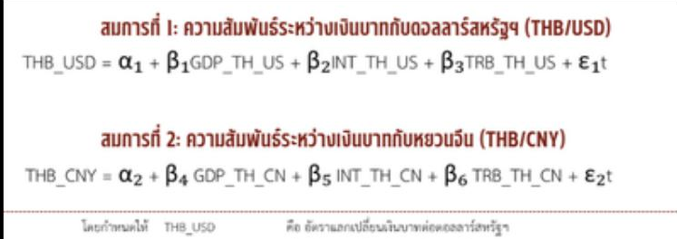
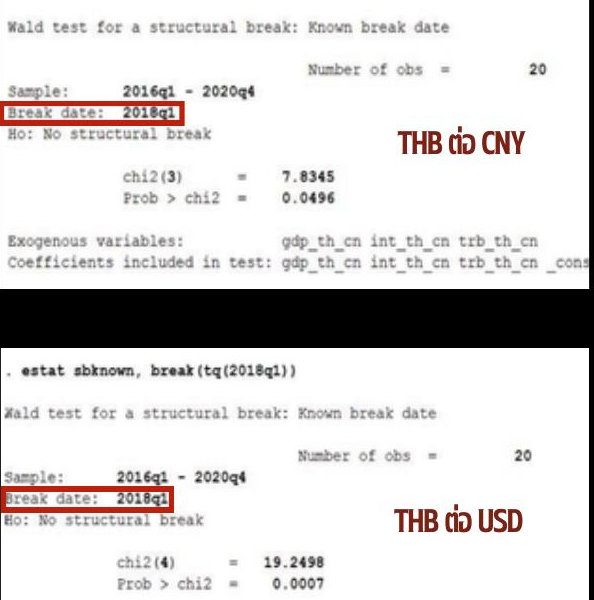
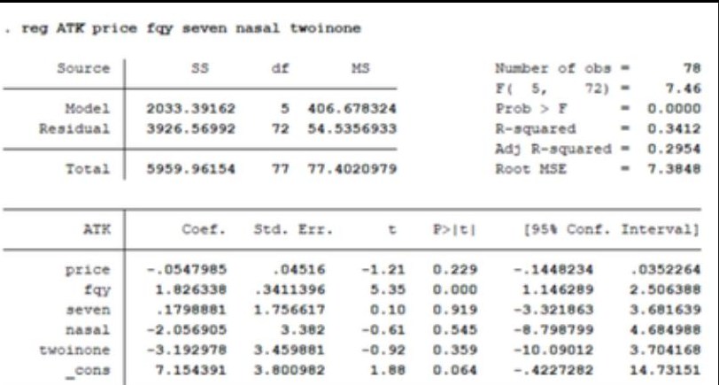
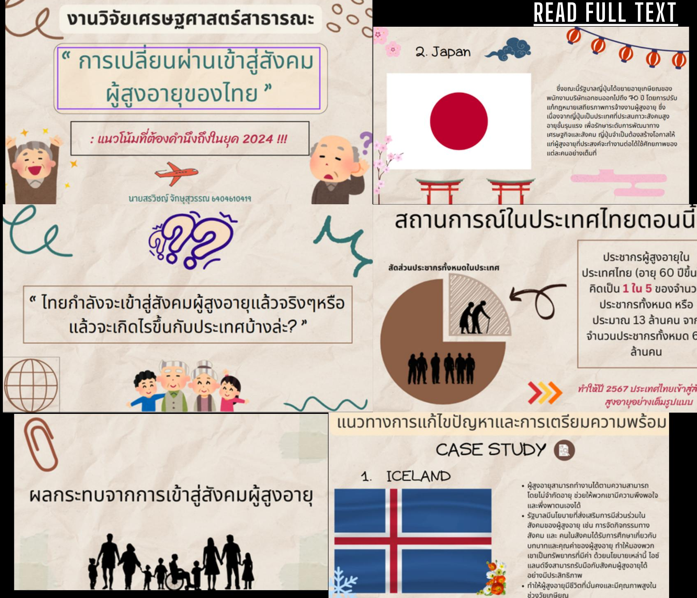
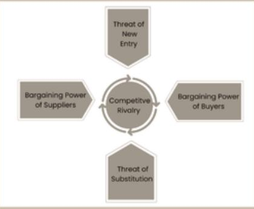
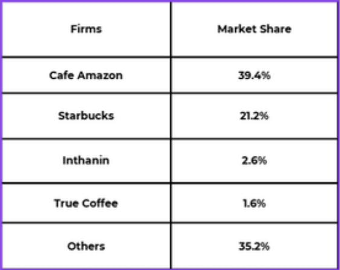
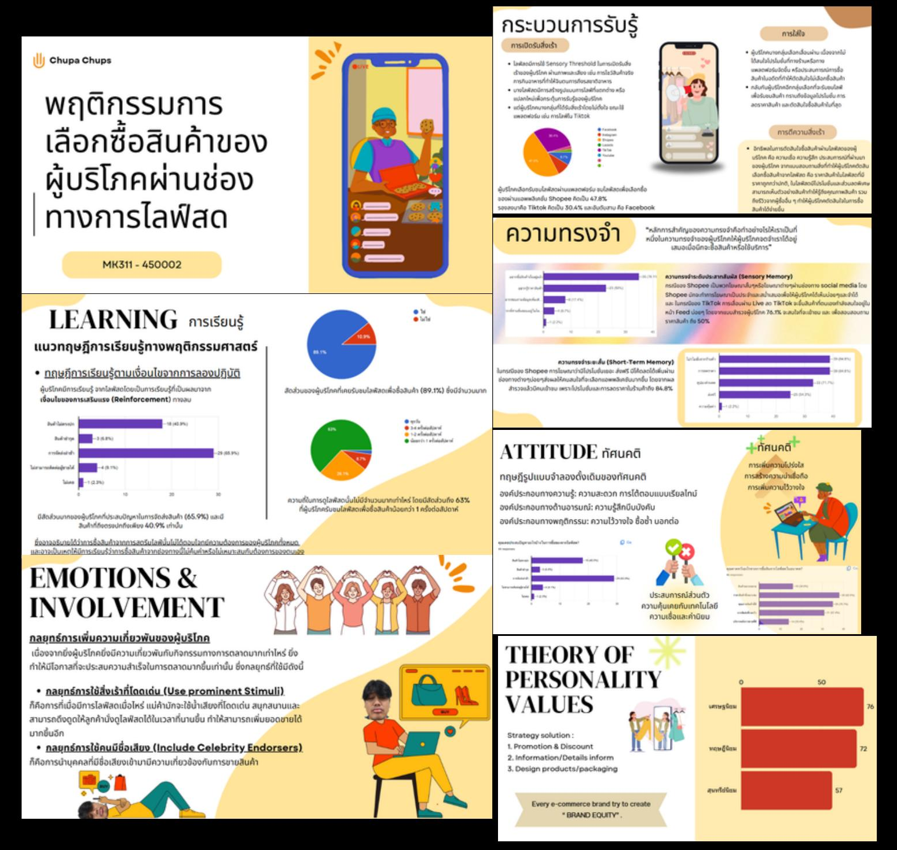

# Academic & Research Projects

Coursework and seminar projects from the Faculty of Economics, Thammasat University, spanning time-series econometrics, applied regression, public policy analysis, and business/consumer research.

## 1. U.S.–China Trade War and Thai Baht Exchange Rate Volatility — International Economics Seminar (Seminar 459)

**Objective:** Test whether the U.S.–China trade war changed the relationship between key economic variables and the Thai Baht's exchange rate against the USD and CNY.

**Data & Method:** Quarterly data, 2016–2020 (20 quarters). Two OLS regression models, estimated with Stata:
```
Model 1 (THB/USD): THB_USD = α1 + β1·GDP_TH_US + β2·INT_TH_US + β3·TRB_TH_US + ε1
Model 2 (THB/CNY): THB_CNY = α2 + β4·GDP_TH_CN + β5·INT_TH_CN + β6·TRB_TH_CN + ε2
```
- `GDP_TH_US` / `GDP_TH_CN` — GDP differential between Thailand and the U.S. / China
- `INT_TH_US` / `INT_TH_CN` — policy interest rate differential
- `TRB_TH_US` / `TRB_TH_CN` — trade balance between Thailand and the U.S. / China

Then tested for a **structural break at 2018Q1** (when the trade war began) using a Wald test for a known structural break date.



**What was found:**
- The structural break test confirmed a significant break at 2018Q1 for **both** exchange rate relationships: THB/CNY (χ² = 7.8345, df = 3, p = 0.0496) and THB/USD (χ² = 19.2498, df = 4, p = 0.0007)
- This means the relationship between the tested economic variables and the exchange rate genuinely shifted after the trade war began — it wasn't just noise
- Trade balance and interest rate differentials in particular were flagged as the variables most likely to threaten long-term exchange rate stability going forward



**Tools:** Stata, OLS regression, Wald structural break test

---

## 2. Determinants of ATK Test Kit Purchases — Introductory Econometrics (EC325)

**Objective:** Identify which factors affect the monthly quantity of ATK (antigen test kit) purchases, using a multiple regression model.

**Data & Method:** Survey data (n = 78) collected via Google Forms; analyzed with Ordinary Least Squares (OLS) regression in Stata, including a correlation check and a robust-standard-error re-estimation.

**Model:**
```
atk_i = β1 + β2·price_i + β3·fqy_i + β4·seven_i + β5·nasal_i + β6·2in1_i + u_i
```
- `price` — price of the test kit · `fqy` — frequency of exposure risk · `seven` — availability through 7-Eleven · `nasal` — nasal-swab test type · `2in1` — 2-in-1 test type



**What was found:**
```
atk_i = 7.154391 − 0.0547985·price + 1.826338·fqy + 0.179888·seven − 2.056905·nasal − 3.192978·2in1 + u_i
```
- A 1-baht increase in price was associated with a 0.0548-unit decrease in average monthly purchase quantity, holding other factors constant
- `fqy` (risk exposure frequency) was the strongest positive driver of purchase quantity — people who felt more at risk bought more, regardless of price
- Overall model fit was modest (R² ≈ 0.34), so price and the tested product-type variables only explain part of the variation in purchase behavior

**Tools:** Stata, OLS regression, correlation matrix, robust standard errors

---

## 3. Thailand's Transition into an Aging Society — Public Economics (EC340)

**Objective:** Assess how prepared Thailand is for its transition into a full aged society (60+ population expected to reach ~13 million, roughly 1 in 5 people, by 2024) and identify policy directions from international case studies.

**Approach:** Analyzed Thailand's current demographic situation, then examined the economic, social, healthcare, and infrastructure impacts of population aging, benchmarked against two case studies:
- **Japan** — extending the retirement age within private-sector companies
- **Iceland** — policies promoting continued social participation among older adults



**What was found:** Aging impacts extend across four connected areas — labor force size (economic), household structure and welfare (social), medical infrastructure (health), and public service infrastructure — meaning a single-sector policy response (e.g., healthcare spending alone) would be insufficient. Japan's and Iceland's approaches offer two different but complementary reference points: extending working life vs. keeping older adults socially engaged.

---

## 4. Five Forces Analysis: Starbucks — Business Economics (EC486)

**Objective:** Evaluate Starbucks' competitive position in the Thai coffee market using Porter's Five Forces framework.

**Approach:** Assessed Competitive Rivalry (market share and concentration ratio), Threat of New Entry, Bargaining Power of Buyers, Bargaining Power of Suppliers (via gross profit margin and accounts-payable turnover trends), and Threat of Substitution.





**What was found:**
- Starbucks holds ~21.2% of the Thai coffee shop market, behind Cafe Amazon at ~39.4%
- Despite the smaller share, Bargaining Power of Buyers is high (low switching costs) but is partly offset by Starbucks' loyalty/rewards program and premium brand positioning
- Supplier power and substitution risk (tea, other local beverage options) were identified as more structurally persistent threats than new-entrant competition

---

## 5. Consumer Purchasing Behavior on Live Streaming Platforms — Consumer Behavior (MK311)

**Objective:** Examine what drives purchasing decisions during livestream shopping (TikTok, Shopee Live, Lazada Live), using consumer psychology theory.

**Framework applied:** Perception, Learning, Memory, Motivation, Emotion & Involvement, Attitude, and Personality/Brand-value theory.



**What was found:**
- Livestream commerce converts attention into purchases primarily through **urgency** (flash deals, "act now" framing) and **parasocial trust** in the livestream host — a different mechanism than traditional e-commerce browsing
- Emotional involvement ("fun + atmosphere") was identified as a stronger short-term purchase trigger than rational price comparison
- Long-term brand equity still depended on the more traditional Attitude/Trust pathway, not just in-the-moment livestream excitement — meaning livestream tactics alone aren't enough to build a returning customer base
